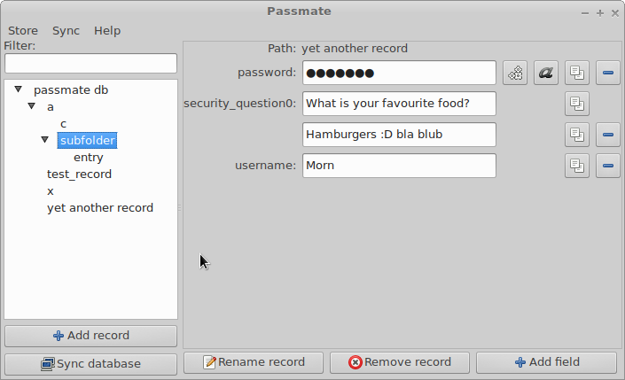

# PassMate

With the password manager PassMate, you can keep track of all your important and unimportant passwords, login credentials, product keys, credit card data etc.

## Platform independence

PassMate runs on Windows, Mac and Linux and can synchronize your passwords across all your devices.

## Security

Your passwords are encrypted when they are stored locally or synchronized.

## Open source

PassMate's source code is open source and licensed under the Apache 2.0 license.

## Sync passwords between computers

Free sync server for PassMate. More information coming soon.

## Binary distribution

Coming soon.

## Documentation

Please have a look in the doc/ subfolder.
