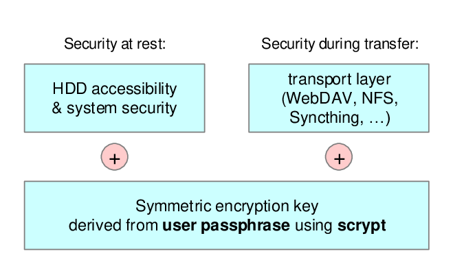

.. _Security:

Security
========

Passmate provides a basic concept for keeping a database of your secret data (passwords, login credentials etc.) and synchronizing this database across different machines. Both the file system and the synchronization method need to be taken into account when considering the security of your setup. Passmate can use :ref:`container encryption <EncCont>` as an additional security measure to ensure confidentiality and integrity of your secret data both at rest (on your hard drive) and in motion (during synchronization). This additional security layer hinges on the strength and confidentiality of your passphrase.

Unencrypted containers
----------------------

When an empty container passphrase is entered, Passmate stores the :ref:`JSON database <DB>` as plain JSON text file. In this case, you solely rely on your filesystem and synchronization mechanism to provide the desired information security. Using unencrypted containers is **not recommended**.

.. _EncCont:

Encrypted containers
--------------------

When a non-empty passphrase is entered, Passmate stores the :ref:`JSON database <DB>` in an **encrypted containers**. For best security, use an encrypted containers with a strong passphrase.

When using encrypted containers, a user-defined passphrase guards access to the database. The passphrase needs to be entered when Passmate is launched and is used to derive the encryption and hashing keys to ensure confidentiality and integrity. Scypt has been chosen as key derivation function in order to maximize the effort required for brute-force guessing of the passphrase.

Passmate containers use the scrypt / tarsnap file format specified `here <https://github.com/Tarsnap/scrypt/blob/master/FORMAT>`_:

+--------+----------------+----------------------------------------------------------+
| offset | length (bytes) | content                                                  |
+========+================+==========================================================+
| 0      | 6              | "scrypt"                                                 |
+--------+----------------+----------------------------------------------------------+
| 6      | 1              | scrypt data file version number (== 0)                   |
+--------+----------------+----------------------------------------------------------+
| 7      | 1              | log2(N) (must be between 1 and 63 inclusive)             |
+--------+----------------+----------------------------------------------------------+
| 8      | 4              | r (big-endian integer; must satisfy r * p < 2^30)        |
+--------+----------------+----------------------------------------------------------+
| 12     | 4              | p (big-endian integer; must satisfy r * p < 2^30)        |
+--------+----------------+----------------------------------------------------------+
| 16     | 32             | salt                                                     |
+--------+----------------+----------------------------------------------------------+
| 48     | 16             | first 16 bytes of SHA256(bytes 0 .. 47)                  |
+--------+----------------+----------------------------------------------------------+
| 64     | 32             | HMAC-SHA256(bytes 0 .. 63)                               |
+--------+----------------+----------------------------------------------------------+
| 96     | X              | data xor AES256-CTR key stream generated with nonce == 0 |
+--------+----------------+----------------------------------------------------------+
| 96+X   | 32             | HMAC-SHA256(bytes 0 .. 96 + (X - 1))                     |
+--------+----------------+----------------------------------------------------------+

The 512-bit result of the scypt function is used as follows:

- The lower 256 bits are used for AES256-CTR.
- The upper 256 bits are used for HMAC-SHA256.